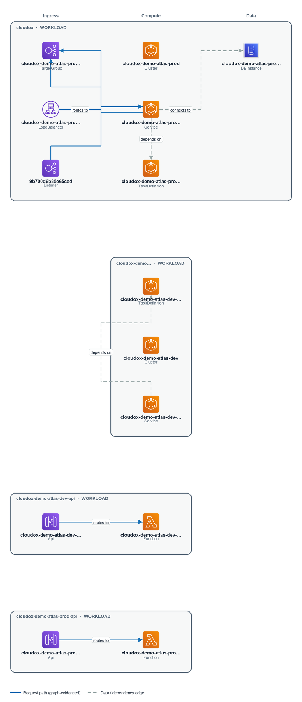

# Generic View — Architecture Summary

> **Demo Report** — AWS account IDs and resource identifiers in this report have been
> replaced with synthetic equivalents for public safety. Architecture, workloads,
> findings, and relationships are based on a real AWS environment.

---

> _Part of the [Generic View](./README.md) · Audience: Any technical reader · Confidence: Likely_

## Architecture Summary

This environment is a multi-account AWS deployment centred on **eu-central-1**, organised around three distinct workload groupings — a production Atlas platform, a development Atlas platform, and a sandbox — each living in its own AWS account and VPC. Internet-facing API traffic enters through API Gateway endpoints, and DynamoDB tables serve as the primary data stores across the workloads.

### Systems & Workloads

Four workloads and one higher-level system grouping are identifiable from the discovered graph:

| Friendly Name | Account | Region | Confidence |
|---|---|---|---|
| Cloudox | 122122642149 | eu-central-1 | Verified |
| Cloudox Demo Atlas Prod API | 122122642149 | eu-central-1 | Likely |
| Cloudox Demo Atlas Dev | 105769365151 | eu-central-1 | Likely |
| Cloudox Demo Atlas Dev API | 105769365151 | eu-central-1 | Likely |
| Cloudox Demo Sandbox Scratch | 161388682021 | eu-central-1 | Assumed |

A system-level grouping named **Cloudox Demo Atlas Dev** (no account binding) is also present, likely representing a logical grouping that spans or abstracts the dev-tier resources — treat this with caution as it is inferred rather than directly observed.

The **Cloudox** workload (account `122122642149`) is the most structurally confirmed entity (Verified). The two Atlas API workloads — prod and dev — are the internet-facing surfaces, each backed by an API Gateway endpoint: `https://xdmn5ldmif.execute-api.eu-central-1.amazonaws.com` (prod) and `https://gfwaiva01f.execute-api.eu-central-1.amazonaws.com` (dev). Both endpoints are reachable from the internet.

Data persistence is handled by DynamoDB:
- **cloudox-demo-atlas-dev-items** (`arn:aws:dynamodb:eu-central-1:105769365151:table/cloudox-demo-atlas-dev-items`) — dev tier, account `105769365151`
- **cloudox-demo-atlas-prod-items** (`arn:aws:dynamodb:eu-central-1:122122642149:table/cloudox-demo-atlas-prod-items`) — prod tier, account `122122642149`
- **cloudox-demo-sandbox-events** (`arn:aws:dynamodb:eu-central-1:161388682021:table/cloudox-demo-sandbox-events`) — sandbox, account `161388682021`
- **cloudox-demo-sandbox-scratch** (`arn:aws:dynamodb:eu-central-1:161388682021:table/cloudox-demo-sandbox-scratch`) — sandbox, account `161388682021`

The **Cloudox Demo Sandbox Scratch** workload (account `161388682021`, Assumed confidence) appears to be an experimental or transient area; its classification relies on inference rather than explicit tagging.

### How It Fits Together

**Network topology** follows a standard multi-VPC, multi-account pattern. Three VPCs are well-characterised:

| VPC | Account | Region | Confidence |
|---|---|---|---|
| Cloudox Demo Atlas Dev VPC (`vpc-0a4d44a07f48d7ca0`) | 105769365151 | eu-central-1 | Verified |
| Cloudox Demo Atlas Prod VPC (`vpc-0aaa6d4f2f981e945`) | 122122642149 | eu-central-1 | Verified |
| Cloudox Demo Sandbox VPC (`vpc-0c97d53850c027a14`) | 161388682021 | eu-central-1 | Verified |

Three additional VPCs appear in the graph with Unknown confidence — `vpc-0fd81e106f24b4e85` (account `161388682021`, us-east-1), `vpc-02298727f33db8908` (account `122980216815`, eu-central-1), and `vpc-0038de9730553c915` (account `110019496666`, eu-central-1) — but their purpose and relationship to the named workloads is not established from this section's evidence.

Internet gateways are present in multiple accounts and regions, confirming outbound (and likely inbound) internet connectivity for at least the dev and prod Atlas VPCs:
- `igw-0d14f1dd4e54d5906` — account `110019496666`, eu-central-1
- `igw-00ed21b9a0e6596a8` — account `110019496666`, us-east-1
- `igw-0567575921f471548` — account `105769365151`, us-east-1

A NAT Elastic IP (`eipalloc-083eada77de5498db`, named `cloudox-demo-atlas-dev-nat-eip`) is allocated in account `105769365151` (eu-central-1), indicating the dev VPC uses a NAT gateway for private-subnet egress. A network interface (`eni-058ad447b7287912a`) exists in the prod account (`122122642149`, eu-central-1), though its attachment context is not detailed in this section's evidence.

A **disaster-recovery footprint** is visible in us-east-1 for the prod account: a CloudFormation StackSet-deployed stack (`StackSet-cloudox-demo-workload-prod-dr-…`, `arn:aws:cloudformation:us-east-1:122122642149:stack/StackSet-cloudox-demo-workload-prod-dr-e27aba00-144f-1560-0aed-593e2d919536/acb94bf7-b3da-c32a-1613-327a5c08def2`) and a CloudWatch alarm monitoring DR bucket size (`cloudox-demo-atlas-prod-dr-bucket-size`, `arn:aws:cloudwatch:us-east-1:122122642149:alarm:cloudox-demo-atlas-prod-dr-bucket-size`) suggest an S3-based DR replication arrangement for the prod workload.

> **Confidence — Likely.** The structural picture is derived from graph evidence. 781 resources carry no Environment/Stage/Tier tag, so workload membership for several entities relies on inference rather than explicit classification. Treat Assumed and Unknown entities as candidates for validation with the environment owner.

### Changes Since Previous Snapshot

Between the snapshot at 2026-07-20T11:50 UTC and the current snapshot at 2026-07-20T12:54 UTC, several notable additions were observed:

- **Three services entered discovered scope**: Security Hub (`securityhub`), Systems Manager (`ssm`), and Step Functions (`stepfunctions`) — these were not present in the previous snapshot.
- **DR infrastructure added in prod (us-east-1)**: A new CloudFormation stack (`StackSet-cloudox-demo-workload-prod-dr-…`) and a CloudWatch alarm (`cloudox-demo-atlas-prod-dr-bucket-size`) appeared, consistent with a DR deployment being stood up for the prod workload.
- **New DynamoDB table in sandbox**: `cloudox-demo-sandbox-events` was added to account `161388682021` (eu-central-1).
- **NAT EIP allocated in dev**: `eipalloc-083eada77de5498db` (`cloudox-demo-atlas-dev-nat-eip`) was added to account `105769365151`, suggesting NAT gateway provisioning in the dev VPC.
- **New network interface in prod**: `eni-058ad447b7287912a` was added to account `122122642149` (eu-central-1).
- Two workloads grew in member resource count: **Cloudox** (9 → 10 resources) and **Cloudox Demo Atlas Dev** (4 → 5 resources) — these are inferred grouping changes.

An additional 80 related changes exist beyond what is listed here; see the Environment Evolution page for the full picture.

> **Figure — Workload architecture.** What are the significant workloads and how do their tiers connect? Scope: generic view · architecture summary. 4 of 5 inferred workload(s) shown (most significant first) with ingress → compute → data tiers. Edges are drawn only where a graph relationship exists. 1 additional workload(s) omitted to keep the diagram readable.
