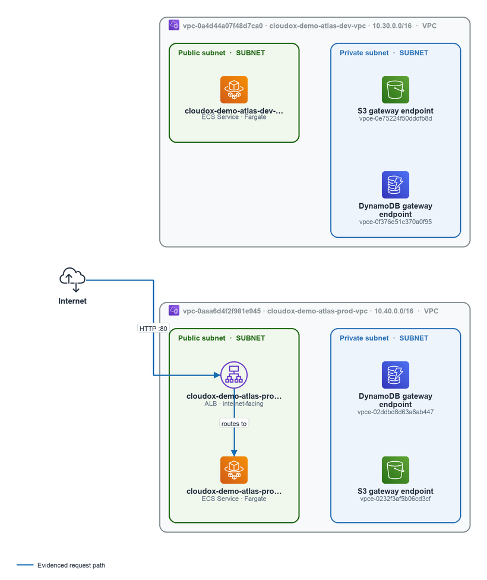

# Security View — Network Access Paths

> **Demo Report** — AWS account IDs and resource identifiers in this report have been
> replaced with synthetic equivalents for public safety. Architecture, workloads,
> findings, and relationships are based on a real AWS environment.

---

> _Part of the [Security View](./README.md) · Audience: Security & Governance teams · Confidence: Verified_

## Network Access Paths

**Confidence: Verified** — Derived from complete graph evidence for this domain.

Three VPCs across three AWS accounts are internet-facing in eu-central-1, each with its own Internet Gateway. This is the most security-relevant structural fact for this section: internet ingress paths exist in all three environments — Dev, Prod, and Sandbox — and each warrants independent scrutiny of what is reachable from the public internet.

### Ingress Paths

All three VPCs carry an attached Internet Gateway, establishing direct internet ingress capability at the network layer:

| Environment | Account | VPC | Internet Gateway |
|---|---|---|---|
| Atlas Dev | 105769365151 | Cloudox Demo Atlas Dev VPC (`vpc-0a4d44a07f48d7ca0`) | Cloudox Demo Atlas Dev Igw (`igw-0155958a0a5e9c500`) |
| Atlas Prod | 122122642149 | Cloudox Demo Atlas Prod VPC (`vpc-0aaa6d4f2f981e945`) | Cloudox Demo Atlas Prod Igw (`igw-01dd5625ec1ea7a54`) |
| Sandbox | 161388682021 | Cloudox Demo Sandbox VPC (`vpc-0c97d53850c027a14`) | Sandbox Internet Gateway (`igw-08017528fa36ccb4d`) |

Public subnets are confirmed in all three accounts. In account 105769365151 (Dev): `subnet-065f522206524ab12` (Public Subnet b065) and `subnet-0f64d71c952a7898a` (Public Subnet d725). In account 122122642149 (Prod): `subnet-013a24d318ed6f3d0` (Public Subnet 94f8) and `subnet-016c22941a019a137` (Public Subnet 5a8a). In account 161388682021 (Sandbox): `subnet-029e2cceb3d0beff7` (Public Subnet 244e).

The presence of public subnets in the **production** VPC (`vpc-0aaa6d4f2f981e945`) is the highest-priority ingress concern for Security & Governance teams. Any resource placed in those subnets with a public IP and permissive security group rules is directly reachable from the internet. The package does not provide security group rule detail for this section — that evidence is covered elsewhere in this view.

AWS-managed prefix lists `pl-66a5400f` and `pl-6ea54007` (eu-central-1) are present in the evidence set, indicating that at least some security group or route table rules reference AWS service prefix lists (e.g., S3 or DynamoDB gateway endpoints). The specific rules referencing these lists are not detailed in this section's package.

### Lateral Connectivity

A NAT Gateway — **Cloudox Demo Atlas Dev NAT** (`nat-05bf82584b9610324`, account 105769365151, eu-central-1) — is present in the Dev environment. NAT Gateways enable outbound internet access for resources in private subnets without exposing them to inbound connections; their presence confirms that private-subnet workloads in the Dev VPC have egress capability. No equivalent NAT Gateway is evidenced in the Prod or Sandbox VPCs within this section's package.

One intelligence item is relevant to lateral risk in the Prod environment:

> **Critical dependency: DBInstance cloudox-demo-atlas-prod-pg** (`dependency_concern:architecture:cloudox-demo-atlas-prod-pg`) — **Confidence: Verified**
> The workload *Cloudox Demo Atlas Prod API* (account 122122642149) depends on the datastore `cloudox-demo-atlas-prod-pg`, which is not Multi-AZ. A zone failure would take the data tier offline. From a security and governance perspective, this single-AZ configuration also concentrates blast radius: any network-level incident affecting the AZ hosting this datastore would simultaneously impact availability. The recommended action is to confirm Multi-AZ status and backup posture, and to review how the API workload handles a data-tier failure.

No VPC peering, Transit Gateway, or PrivateLink connectivity is evidenced in this section's package. Cross-VPC lateral paths, if any, are covered in other sections of this view.

### Changes Since Previous Snapshot

Between 2026-07-20T11:50 UTC and 2026-07-20T12:54 UTC, several network-layer changes were observed:

- **NAT Gateway added (Observed):** `nat-05bf82584b9610324` (cloudox-demo-atlas-dev-nat) was newly created in account 105769365151. This introduces outbound internet egress for private subnets in the Dev VPC — a meaningful change to the Dev egress posture that should be validated against change management records.
- **Public subnet IP counts decreased (Observed):** `subnet-065f522206524ab12` (Dev public-a) dropped from 251 → 249 available IPs, and `subnet-013a24d318ed6f3d0` (Prod public-a) dropped from 250 → 249. This indicates new resources were placed in these public subnets — the specific ENIs are reflected in the relationship changes below.
- **ENI-to-subnet relationships added (Observed):** New interface placements were recorded: `eni-0dbafb51ea9a9ffd3` and `eni-00815b97162c6a5fc` into Dev public subnet `subnet-065f522206524ab12`; `eni-0fa5e7a1b3798b7d3` into Prod public subnet `subnet-013a24d318ed6f3d0`; `eni-058ad447b7287912a` into `subnet-0b0384769d442046a`; and `eni-0d070d51a01905b0b` into Dev public subnet `subnet-0f64d71c952a7898a`.
- **ENI-to-subnet relationships removed (Observed):** `eni-0c9de7ff9cd35fe20` was removed from `subnet-0b0384769d442046a`, and `eni-0596723d0b7500459` was removed from `subnet-0f64d71c952a7898a`, indicating interfaces were detached or terminated.

The new ENIs placed in public subnets — particularly `eni-0fa5e7a1b3798b7d3` in the **Prod** public subnet — warrant validation: confirm what resource owns each interface, whether it carries a public IP, and whether the associated security groups restrict inbound access appropriately.

Note: 26 additional related changes exist beyond those listed here. See the **Environment Evolution** page for the full set.

> **Figure — Workload VPC network topology.** Which workload VPCs exist, how is each tiered, and what is reachable from the internet? Scope: security view · network access paths. 2 of 2 workload VPC(s) shown with subnet tiers and evidence-backed connectivity. Default VPCs omitted. Tiers are route-grounded (public = Internet Gateway route or internet-facing load balancer).
